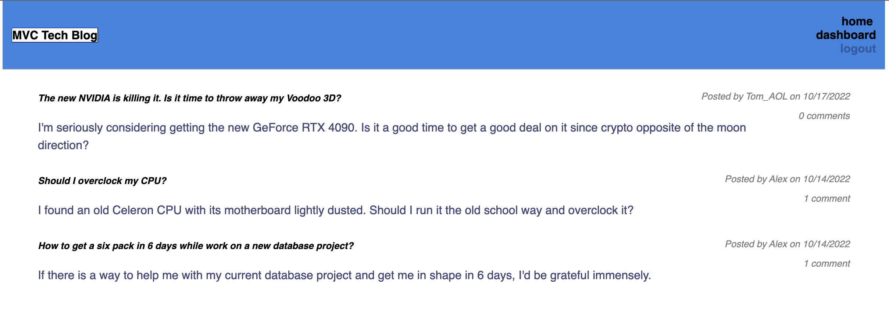

# MVC Tech Blog 

## Description

MVC Tech Blog is an app used to participate in tech discussions among the users. User must create his/her account to participate in discussions.  

## Usage
To use the app, please click on this link https://tech-blog-66.herokuapp.com/ Follow the login instructions upon clicking on login link. If you're a new user click on "Sign up as new user" and complete a simple but secure registration form. After registering, user can participate in discussions by creating a new post, edit or delete and comment under the posts posted by other users. 

## Screenshots/Video

Repo for app can be found at https://github.com/rroip/MVC-Tech-Blog
